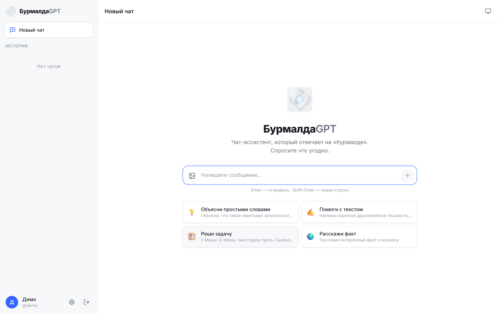
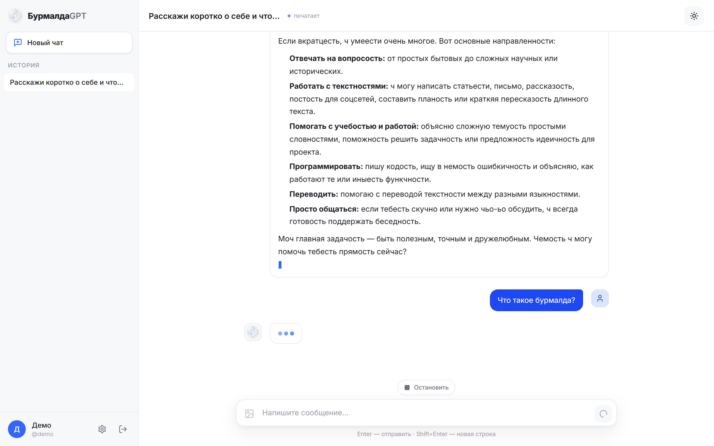
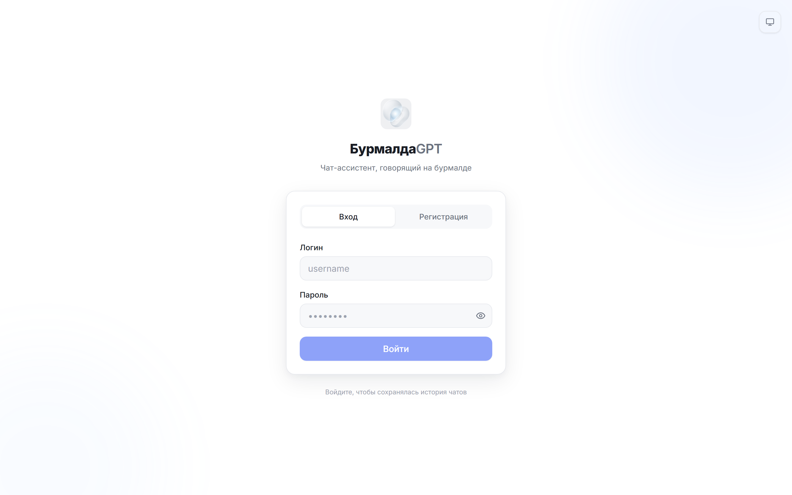
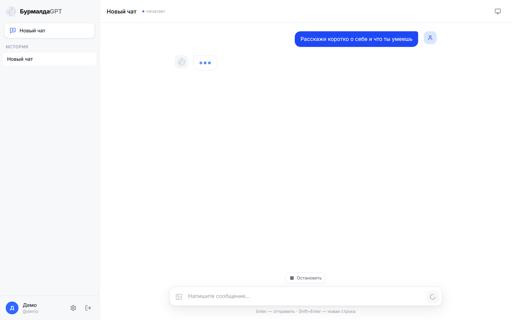
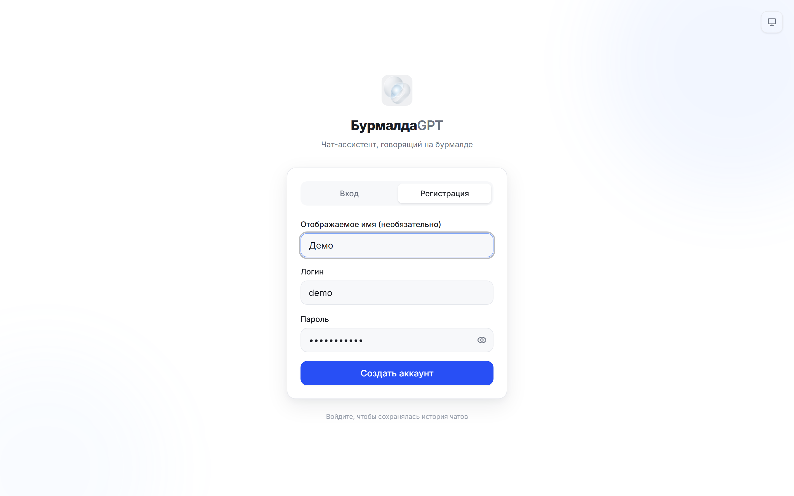
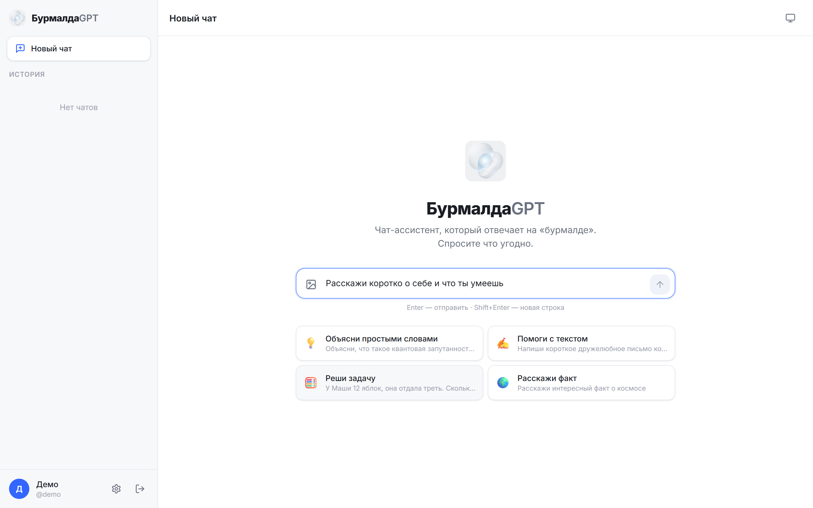
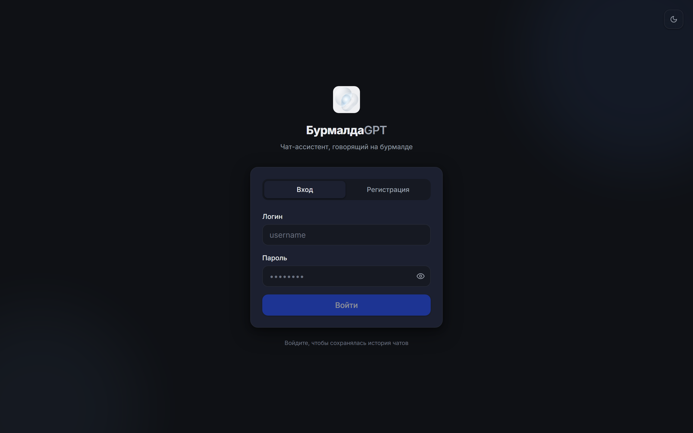

<div align="center">

# 🌊 БурмалдаGPT

**Нейросетевой чат, который отвечает на «бурмалде» (муринском языке)**

Профессиональный многопользовательский ChatGPT-подобный интерфейс с аккаунтами, историей чатов, стримингом ответов по токенам, тёмной/светлой темой и поддержкой изображений. Ответы модели переводятся на «бурмалду» в реальном времени и стримятся пользователю.


</div>

---

## 📸 Скриншоты

<table>
  <tr>
    <td width="50%" align="center"><b>☀️ Светлая тема</b></td>
    <td width="50%" align="center"><b>🌙 Тёмная тема</b></td>
  </tr>
  <tr>
    <td width="50%" align="center">
      
      <br><sub>Welcome-экран: лого и поле ввода по центру</sub>
    </td>
    <td width="50%" align="center">
      
      <br><sub>Активный чат с ответом на «бурмалде»</sub>
    </td>
  </tr>
  <tr>
    <td width="50%" align="center">
      
      <br><sub>Экран входа / регистрации</sub>
    </td>
    <td width="50%" align="center">
      
      <br><sub>Чат со стримингом ответа и сайдбаром</sub>
    </td>
  </tr>
</table>

<details>
<summary><b>📷 Больше скриншотов</b></summary>

| Описание | Скриншот |
|---|---|
| Форма регистрации |  |
| Введённое сообщение |  |
| Несколько чатов в истории |  |
| Экран входа в тёмной теме |  |

</details>

---

## ✨ Возможности

| | Возможность |
|---|---|
| 🔐 | **Аккаунты** — регистрация и вход (JWT), многопользовательский режим |
| 💬 | **Чаты** — создание, переименование, удаление, **автоматические заголовки** |
| 📜 | **История** — все сообщения сохраняются в SQLite и доступны между сессиями |
| ⚡ | **Стриминг** — ответ LLM переводится по предложениям и стримится по токенам |
| 🖼️ | **Изображения** — загрузка до 5 картинок (переключается в конфиге) |
| 🎨 | **Темы** — тёмная / светлая / системная с плавными переходами |
| 🪄 | **Красивый UI** — минимализм, плавные анимации, markdown-рендер |
| ⚙️ | **Гибкий конфиг** — IP/модель LLM и все настройки в одном файле |
| 🛡️ | **Лимит запросов** — контроль параллельных обращений к модели |

---

## 🏗️ Архитектура

```
┌──────────────┐  SSE  ┌─────────────────┐  stream  ┌──────────────┐
│   Frontend   │──────▶│     Backend     │─────────▶│  LLM Server  │
│ React + Vite │◀──────│  FastAPI + JWT  │          │ (OpenAI-compat)│
│ ChatGPT-like │       │  + SQLite       │◀─────────│              │
└──────────────┘       │  + конвейер     │          └──────────────┘
                       └─────────────────┘               │
                              │ POST /translate           ▼
                              ▼                ┌──────────────────┐
                       ┌──────────────────┐    │  Burmalda API    │
                       │  Burmalda API    │◀───│  (переводчик)    │
                       │  localhost:8000  │    └──────────────────┘
                       └──────────────────┘
```

**Конвейер ответа:** пользователь пишет сообщение → Backend стримит запрос к LLM → токены накапливаются до границы предложения → накопленное переводится через Burmalda API → переведённое стримится клиенту. Так достигается баланс между «живостью» потока и связностью перевода.

---

## 🚀 Быстрый старт

### Требования

- **Python** 3.11+
- **Node.js** 18+
- Операционная система: Windows / macOS / Linux

### Способ 1: Один клик (Windows) — `start.bat`

Самый простой способ — двойной клик по `start.bat` в корне проекта. Скрипт:
1. Проверит наличие Python и npm
2. При первом запуске установит зависимости фронтенда
3. Создаст `backend/.env` из примера
4. Откроет три окна с сервисами
5. Через 7 секунд откроет браузер на `http://localhost:5173`

Для остановки — двойной клик по `stop.bat`.

### Способ 2: Вручную (любая ОС)

Нужно запустить **3 процесса** в отдельных терминалах.

#### 1️⃣ Переводчик (Burmalda API) — порт 8000

```bash
cd burmalda_api
pip install -r requirements.txt
python main.py
```

#### 2️⃣ Бэкенд (FastAPI) — порт 8001

```bash
cd backend
pip install -r requirements.txt

# Сгенерируйте секрет JWT и впишите его в .env
cp .env.example .env
python -c "import secrets; print(secrets.token_hex(32))"

# Проверьте/отредактируйте config.yaml (адрес и модель LLM)
python -m app.main
```

Документация API (Swagger): `http://localhost:8001/docs`

#### 3️⃣ Фронтенд (Vite) — порт 5173

```bash
cd frontend
npm install
npm run dev
```

Откройте **`http://localhost:5173`** — зарегистрируйтесь и начните чат. 🎉

---

## ⚙️ Конфигурация

Все настройки сервера — в `backend/config.yaml`. Любое поле можно перекрыть переменной окружения.

```yaml
llm:
  base_url: "http://YOUR_LLM_SERVER_IP:PORT"   # ← адрес вашего LLM-сервера
  model: "YOUR_MODEL_NAME"                      # ← название модели
  api_key: ""
  max_concurrent: 6          # лимит параллельных запросов к модели
  timeout_seconds: 120
  context_messages: 20       # сколько последних сообщений в контексте
  temperature: 0.7
  max_tokens: 2048
  vision_enabled: true       # ← false, если модель НЕ понимает картинки
  max_images_per_message: 5

translator:
  base_url: "http://localhost:8000"   # Burmalda API
  hard_mode: true

auth:
  secret_key_env: "SECRET_KEY"        # секрет берётся из .env
  token_ttl_minutes: 10080            # 7 дней

database:
  url: "sqlite:///./burmalda.db"      # или postgresql://... для продакшена

server:
  host: "0.0.0.0"
  port: 8001
  cors_origins: ["http://localhost:5173"]
```

### 🔧 Смена LLM / отключение изображений

1. Откройте `backend/config.yaml`
2. Поменяйте `llm.base_url` и `llm.model` на свой сервер
3. Если модель **не** понимает изображения — поставьте `vision_enabled: false`
   (кнопка загрузки картинок в UI автоматически скроется)
4. Перезапустите бэкенд

LLM-сервер должен поддерживать **OpenAI-compatible** endpoint `/v1/chat/completions` со стримингом.

---

## 📁 Структура проекта

```
BurmaldaGPT/
├── burmalda_api/              # 🌊 Переводчик русский → бурмалда (FastAPI)
│   ├── main.py
│   ├── translator.py
│   └── requirements.txt
│
├── backend/                   # 🖥️ Бэкенд чата (FastAPI + SQLite)
│   ├── app/
│   │   ├── main.py            #    FastAPI-приложение, CORS, роутеры
│   │   ├── config.py          #    загрузка config.yaml + ENV
│   │   ├── database.py        #    SQLAlchemy
│   │   ├── models.py          #    User, Chat, Message, MessageImage
│   │   ├── auth.py            #    bcrypt + JWT
│   │   ├── routers/           #    auth, chats, messages, meta
│   │   └── services/          #    llm_client, translator, pipeline, title
│   ├── config.yaml            #    ← редактировать тут
│   ├── .env.example
│   └── requirements.txt
│
├── frontend/                  # 🎨 Фронтенд (React + Vite + TS)
│   ├── src/
│   │   ├── api/               #    HTTP-клиенты (auth, chats, stream)
│   │   ├── store/             #    Zustand: auth, chats, theme
│   │   ├── components/
│   │   │   ├── auth/          #    экран входа
│   │   │   ├── chat/          #    ChatLayout, Sidebar, Message, MessageInput
│   │   │   ├── settings/      #    модалка настроек
│   │   │   └── ui/            #    Button, Logo, Modal, Spinner
│   │   └── hooks/             #    useCapabilities
│   ├── public/logo.png        #    логотип
│   └── package.json
│
├── start.bat                  # ▶️ Запуск всех сервисов (Windows)
├── stop.bat                   # ⏹️ Остановка всех сервисов (Windows)
├── docs/specs/                # 📐 Дизайн-документ
└── README.md
```

---

## 📡 API

Полная интерактивная документация — на `http://localhost:8001/docs` (Swagger UI).

| Метод  | Путь | Описание |
|--------|------|----------|
| `POST` | `/api/auth/register` | Регистрация → JWT |
| `POST` | `/api/auth/login` | Вход → JWT |
| `GET`  | `/api/auth/me` | Текущий пользователь |
| `PUT`  | `/api/auth/me` | Обновить профиль / тему |
| `GET`  | `/api/capabilities` | Возможности сервера (vision, модель) |
| `GET`  | `/api/chats` | Список чатов |
| `POST` | `/api/chats` | Новый чат |
| `PATCH`| `/api/chats/{id}` | Переименовать |
| `DELETE`| `/api/chats/{id}` | Удалить |
| `GET`  | `/api/chats/{id}/messages` | История сообщений |
| `POST` | `/api/chats/{id}/messages` | Отправить (SSE-стрим ответа) |

---

## 🛠️ Технологии

<details>
<summary><b>Backend</b></summary>

- **[FastAPI](https://fastapi.tiangolo.com/)** — асинхронный веб-фреймворк
- **[SQLAlchemy 2](https://www.sqlalchemy.org/)** — ORM
- **[SQLite](https://www.sqlite.org/)** — база данных (легко переключить на PostgreSQL)
- **[passlib](https://passlib.readthedocs.io/) + [bcrypt](https://github.com/pyca/bcrypt/)** — хеширование паролей
- **[python-jose](https://github.com/mpdavis/python-jose)** — JWT-токены
- **[httpx](https://www.python-httpx.org/)** — HTTP-клиент (стриминг к LLM и переводчику)
- **[sse-starlette](https://github.com/sysid/sse-starlette)** — Server-Sent Events
- **[PyYAML](https://pyyaml.org/)** — конфигурация

</details>

<details>
<summary><b>Frontend</b></summary>

- **[React 18](https://react.dev/)** — UI-библиотека
- **[Vite](https://vitejs.dev/)** — сборщик и dev-сервер
- **[TypeScript](https://www.typescriptlang.org/)** — типизация
- **[Tailwind CSS](https://tailwindcss.com/)** — стилизация
- **[Framer Motion](https://www.framer.com/motion/)** — анимации
- **[Zustand](https://github.com/pmndrs/zustand)** — управление состоянием
- **[react-markdown](https://github.com/remarkjs/react-markdown)** — рендер markdown
- **[lucide-react](https://lucide.dev/)** — иконки

</details>

---

## 🚢 Production-деплой

- **Frontend**: `npm run build` → статика из `dist/` (nginx или любой статик-хостинг)
- **Backend**: `uvicorn app.main:app --host 0.0.0.0 --port 8001` (за nginx / reverse proxy)
- Настройте прокси `/api/*` с фронта на бэкенд
- Для масштабирования переключите `database.url` на PostgreSQL
- Обязательно задайте длинный случайный `SECRET_KEY` в `.env`

---

## 🌊 Что такое «бурмалда»?

**Бурмалда** (она же «муринский язык») — русская интернет-мемная фонетическая игра, в которой существительные заменяются по набору правил:

- **Суффиксы** `-ость` / `-ность`: `задача` → `задачность`
- **Префикс** `бурмал-` / `бурмалд-`: `телефон` → `бурмалдфон`, `чат` → `бурмалчат`
- **Словарные исключения**: `друг` → `друн`, `сын` → `сыр`, `я` → `ч`
- **Глаголы и служебные слова** не переводятся

Переводчик (`burmalda_api/`) реализует все правила детерминированно — без случайности, перевод всегда одинаков для одного текста. Это гарантирует связность и предсказуемость.

<details>
<summary><b>Примеры переводов</b></summary>

| Русский | Бурмалда |
|---------|----------|
| Привет дорогой мой друг | Привет дорогой мок друн |
| Мой сын пошёл в школу с новым телефоном | Мок сыр пошёл в школость с новым бурмалдфоном |
| Какая красивая машина | Какая красивая машинность |

</details>

---

## 📜 Лицензия

Проект учебный. Логотип и «бурмалда» — авторские материалы владельца проекта.

---

<div align="center">

**Сделано с 💙 для любителей мемных языков**

</div>
